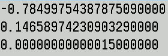

[English](#english) | [Русский](#russian)
<a name="english"></a>

# Mandelbrot set. 60 FPS and palette rotation

## Palette Rotation Logic
0 is Green, 1 is Blue, and 2 is Red. 256 colors.

```pascal
pal[a][0]:=round(127+127cos(2pia/255));
pal[a][1]:=round(127+127sin(2pia/255));
pal[a][2]:=Random(256)
```

The engine uses an 8-bit indexed color mode specifically for lightning-fast performance:
*   **SetDIBColorTable Optimization:** The rendering pipeline relies on SetDIBColorTable, which is designed exclusively for indexed palettes.
*   **Hardware Efficiency:** Since the palette is limited to 256 entries, rotating the colors only requires modifying **1024 bytes** (1 KB) of data.
*   **Instant Updates:** Because we only update 1 KB of color data instead of re-rendering millions of pixels, the palette rotation remains incredibly smooth and fast, even on legacy hardware.

## Seamless Synchronization with DwmFlush
The engine achieves perfect visual smoothness by synchronizing directly with the Windows Desktop Window Manager (DWM):
*   **Adaptive Refresh Rate:** Instead of a hardcoded frame limit, the application uses DwmFlush(). This pauses code execution until the DWM has finished compositing the screen.
*   **Monitor-Dependent FPS:** 
    - If your monitor is set to **60 Hz**, you get **60 FPS**.
    - If you are using a gaming monitor at **144 Hz**, the function triggers 144 times per second, delivering **144 FPS**.
    - On high-end **240 Hz** displays, you will see a buttery-smooth **240 FPS**.
*   **Zero Tearing:** By aligning with the system's vertical sync (VSync) settings, the fractal animation remains perfectly stable without any screen tearing.

## Controls & Hotkeys
The application provides intuitive mouse and keyboard controls for exploring the fractal:

### Mouse Controls
*   **Left Click (WM_LBUTTONDOWN):** Zoom in (2x) and center the view around the clicked point.
*   **Right Click (WM_RBUTTONDOWN):** Zoom out (2x) from the current view.

### Keyboard Navigation
*   **F1 - F8 Keys:** Instantly jump to 8 predefined iconic locations within the Mandelbrot set.

```C++
const long double PRESETS[8][3] = {
    {-0.7849975438787509L, 0.1465897423090329L, 0.00000000000015L},
    {-1.39968383250956L, -0.0005525550160L, 0.0000000000146L},
    {-0.8069595889803L, -0.1593850218137L, 0.00000000006L},
    {-0.618733273138252L, -0.456605361076005L, 0.0000000000046L},
    {-0.550327628L, -0.625931405602L, 0.00000000781L},
    {-0.55033233469975L, 0.62593882612931L, 0.0000000000023L},
    {-1.3996669964593604L, 0.0005429083913L, 0.000000000000026L},
    {-0.5503493176297569L, 0.6259309572825709L, 0.00000000000031L}
};
```

*   **UP / DOWN Arrows:** Precision zoom in/out by a factor of **2.0x**.
*   **LEFT / RIGHT Arrows:** Fine-tuned zoom in/out by a factor of **1.1x**.

### Data Management
*   **ENTER (VK_RETURN):** Export current coordinates. The program saves the exact `absc`, `ordi`, and `size_val` to **Mandelbrot.txt**.



*   **BACKSPACE (VK_BACK):** Import coordinates. Reads the three values from **Mandelbrot.txt** and instantly renders that location.

## OpenMP
OpenMP is a standard that tells the compiler, "Take this loop and distribute the iterations among the different processor cores."
Yes, using OpenMP you are doing parallel programming at the Multithreading level.
Everything is powered by **OpenMP** parallel loops for maximum performance.
OpenMP - Scalability: Your code will run equally efficiently on a 4-core laptop and a 128-core server.

## High-Precision Rendering (80-bit vs 64-bit)
Most Mandelbrot explorers use standard **64-bit double precision**, which leads to "pixelation" and math collapse at zoom levels around $10^{14}$. 
This project leverages **80-bit Extended Precision Arithmetic** (`long double`) to push the boundaries of the fractal:

*   **Standard Double (64-bit):** Fails at deep zoom, turning the fractal into a blurry mess.
*   **My Implementation (80-bit):** Provides **4 extra decimal digits** of precision, allowing you to explore **10,000x deeper** ($10^{18}$ range).
*   **Hardware Optimized:** Directly utilizes the **x87 FPU registers** for maximum mathematical depth.

## Look at the results! 


**[Download Latest Version Windows](https://github.com/Divetoxx/Mandelbrot-2/releases)**


<a name="russian"></a>
# Множество Мандельброта. 60 FPS и вращение палитры

## Логика вращения палитры
0 - это Green, 1 - это Blue и 2 - это Red. 256 цветов.

```pascal
pal[a][0]:=round(127+127*cos(2*pi*a/255));
pal[a][1]:=round(127+127*sin(2*pi*a/255));
pal[a][2]:=Random(256)
```

Палитра это специально для 8-битного индексированного режима.
В нем используется SetDIBColorTable, которая работает только с палитрами.
Функция SetDIBColorTable физически не может принять больше 256 записей.
Палитра 256 цветов работает мгновенно, так как вы меняете всего 1 КБ данных.
Когда вы вращаете палитру вы меняете всего 1024 байта, поэтому это работает
невероятно быстро даже на старом железе.

## DwmFlush
А DwmFlush - синхронизация с монитором, как обычно 60 fps. DwmFlush() приостанавливает выполнение вашего кода
до тех пор, пока диспетчер окон (DWM) не обновит экран. Если ваш монитор работает на 144 Гц,
функция будет срабатывать 144 раза в секунду, обеспечивая 144 FPS.
Функция ориентируется на текущую частоту обновления монитора, установленную в настройках Windows.
Если в системе стоит 60 Гц, вы получите 60 FPS. Если монитор поддерживает 240 Гц и это выбрано в настройках - вы
получите 240 FPS. Она даст 60 FPS только если ваш монитор настроен на 60 Гц; на игровых мониторах FPS будет выше, согласно их герцовке. 

## Горячие клавиши
WM_LBUTTONDOWN (Левая кнопка) - увеличиваем масштаб в 2 раза и центрируем новую область вокруг точки клика
а WM_RBUTTONDOWN (Правая кнопка) - уменьшаем. В VK_F1 - VK_F8 - восемь мест Множество Мандельброта на экран.

```C++
const long double PRESETS[8][3] = {
    {-0.7849975438787509L, 0.1465897423090329L, 0.00000000000015L},
    {-1.39968383250956L, -0.0005525550160L, 0.0000000000146L},
    {-0.8069595889803L, -0.1593850218137L, 0.00000000006L},
    {-0.618733273138252L, -0.456605361076005L, 0.0000000000046L},
    {-0.550327628L, -0.625931405602L, 0.00000000781L},
    {-0.55033233469975L, 0.62593882612931L, 0.0000000000023L},
    {-1.3996669964593604L, 0.0005429083913L, 0.000000000000026L},
    {-0.5503493176297569L, 0.6259309572825709L, 0.00000000000031L}
};
```

VK_UP (Стрелка ВВЕРХ) и VK_DOWN (Стрелка ВНИЗ) - увеличиваем и уменьшаем в 2 раза но без точки клика.
А в VK_LEFT (Стрелка ВЛЕВО) и VK_RIGHT (Стрелка ВПРАВО) - в 1.1 раз.

Очень важно VK_RETURN (Enter, Ввод) - у вас сейчас на экран какое-то Множество Мандельброта.
И сейчас оно запишется в файл! Mandelbrot.txt вот таком виде:


А VK_BACK (это та самая клавиша НАД Enter, Backspace) - читает Mandelbrot.txt (читаем три строки из файла) и запускает на экран.

## OpenMP
OpenMP - это стандарт, который говорит компилятору: "Возьми этот цикл и сам раздай итерации разным ядрам процессора".
Используя OpenMP, вы занимаетесь параллельным программированием на уровне многопоточности (Multithreading).
OpenMP - масштабируемость: ваш код будет одинаково эффективно работать как на 4-ядерном ноутбуке,
так и на 128-ядерном сервере.

## Высокоточная отрисовка (80-бит против 64-бит)
Большинство исследователей фрактала Мандельброта используют стандартную **64-битную двойную точность**,
что приводит к "пикселизации" и коллапсу математических вычислений при масштабировании около $10^{14}$.

В этом проекте используется **80-битная арифметика с расширенной точностью** (<long double>) для расширения границ фрактала:

* **Стандартная двойная точность (64-бит):** Не работает при глубоком масштабировании, превращая фрактал в размытое изображение.
* **Моя реализация (80-бит):** Обеспечивает **4 дополнительных десятичных знака** точности, позволяя исследовать **в 10 000 раз глубже** (диапазон $10^{18}$).
* **Аппаратная оптимизация:** Непосредственно использует **регистры FPU x87** для максимальной глубины математических вычислений.

## Посмотрите на результаты!


https://github.com/user-attachments/assets/2015b37e-7a52-485a-93a6-25d0c84cc10f


**[Скачать последнюю версию Windows](https://github.com/Divetoxx/Mandelbrot-2/releases)**

