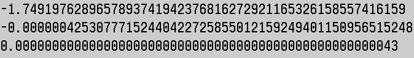

[](#english)
[](#russian)

[](https://github.com/Divetoxx/Mandelbrot-2/releases/latest/download/Mandelbrot_SSE3.exe)
[](https://github.com/Divetoxx/Mandelbrot-2/releases/latest/download/Mandelbrot_AVX2.exe)
[](https://github.com/Divetoxx/Mandelbrot-2/archive/refs/heads/main.zip)
[](https://github.com/Divetoxx/Mandelbrot-2/archive/refs/heads/main.tar.gz)


<a name="english"></a>

# 🇺🇸 English Version

# Mandelbrot GUI: Visualizer with Perturbation Theory (with a $10^{-308}$ hardware limit)

## Credits & Acknowledgments

This project implements advanced orbit phase management paradigms and perturbation algorithms 
developed by the fractal research community. Special thanks to the following authors and pioneers 
from the Fractal Forums, whose collaborative work made this engine possible:
* **Kevin Martin** - for pioneering loop optimization and edge-case escape techniques.
* **Zhuoran Yu** - for developing the dynamic orbit re-basing paradigm.
* **Claude Heiland-Allen** - for extensive deep zoom research and the creation of the MDZ project.

## Key Features:
* **High-Precision Reference:** The 5000-bit reference trajectory is computed exactly once per zoom layer.
* **Hardware-Native Performance:** Blazing-fast math for millions of pixels utilizing hardware-native double registers.
* When using double-precision floating-point numbers (on the order of $10^{-15}$), perturbation theory only allows you to zoom down to the **$10^{-308}$ level-no further.**
* **Innovative Algorithm:** Revolutionary *Reference Reset to Zero* implementation.
* **True 2x2 SSAA:** Pristine, anti-aliased image quality with 4 independent samples per pixel.
* **OpenMP Multi-threading:** High-speed parallel computing to maximize CPU utilization.
* **DwmFlush Synchronization:** Stutter-free, hardware-aligned frame presentation synchronized with Windows DWM.
* **Dynamic Palette Rotation:** Classic, ultra-smooth fractal color-cycling effects with zero performance overhead.

## Arbitrary Precision Arithmetic (Infinite Depth)

The engine is completely free from the hardware limitations of standard 64-bit (`double`) and 128-bit (`__float128`) data types, 
which inevitably lose significance and produce pixelated blocks at depths beyond $10^{-15}$ and $10^{-34}$ respectively.
* **MPFR/GMP Integration**: All high-precision navigation, mouse clicking, and keyboard arrow zooming are handled within a deep binary memory 
structure configured to **5000-bit precision**.
* **308-Digit Decimal:** Viewport coordinates are stored in `Mandelbrot.txt`. While the MPFR 
reference radar computes the center at 5000-bit precision, the hardware native `double` exponent limits the fast pixel engine to a maximum 
depth of $10^{-308}$, providing pristine clarity up to this physical silicon barrier.


## Blazing Fast Perturbation Theory

Deep fractal rendering no longer requires heavy "long-division-style" arbitrary precision math for every individual pixel, which 
historically slowed down deep zoom software by thousands of times.
* **Single-Pass Reference Calculation**: The ultra-heavy MPFR BigFloat radar calculates the precise reference trajectory 
for **only one central pixel per frame and strictly ONCE** at the beginning of the render.
* **Hardware-Accelerated Double Math**: The rest of the viewport (millions of super-sampled pixels) is processed concurrently at the 
native speed of the CPU's hardware `double` registers, calculating only tiny deviations (deltas) from the central axis. 
This optimization boosts rendering speeds by up to 1000x!

## Revolutionary Reference Reset to Zero Algorithm

This is a tremendous point of pride: the engine now operates under the exact same mathematical and architectural principles as the world's most advanced.
* **Dynamic Reset to Zero**: Now, each pixel checks the ratio of its full coordinates against 
its current delta at every step. If the delta grows too large or the central reference orbit terminates, the thread 
dynamically **resets its reading index to zero**, turning the accumulated coordinates into a new autonomous origin.
* **One-Step Beyond Escape Loop Optimization**: To squeeze maximum performance out of the CPU, the MPFR reference radar records 
exactly **one additional point** into the reference orbit array immediately after it exceeds the escape radius.
* **Elimination of Branching (Branch Unrolling)**: This elegant trick completely eliminated cumbersome `if` and `OR` conditions 
from the deepest iteration loop. The processor no longer wastes clock cycles on branch prediction, allowing the compiler 
to perfectly vectorize the math.

## Synchronization with DwmFlush

The engine achieves perfect visual smoothness by synchronizing directly with the Windows Desktop Window Manager (DWM).
*   **Adaptive Refresh Rate:** The application uses DwmFlush. This pauses code execution until the DWM has finished compositing the screen.
*   **Monitor-Dependent FPS:** 
    - If your monitor is set to **60 Hz**, you get **60 FPS**.
    - If you are using a gaming monitor at **144 Hz**, the function triggers 144 times per second, delivering **144 FPS**.
    - On high-end **240 Hz** displays, you will see a buttery-smooth **240 FPS**.

## OpenMP

OpenMP is a standard that tells the compiler, "Take this loop and distribute the iterations among the different processor cores."
Yes, using OpenMP you are doing parallel programming at the Multithreading level.
Everything is powered by **OpenMP** parallel loops for maximum performance.
OpenMP - Scalability: Your code will run equally efficiently on a 4-core laptop and a 128-core server.

## True 2x2 SSAA (Direct RGB Integration)

This project implements "true" 2x2 Super-Sample Anti-Aliasing (SSAA). Each screen pixel is computed from four independent sub-pixel fractal coordinates.
### The Problem with the Standard Approach

A common mistake when anti-aliasing fractals is averaging the raw iteration counts (palette indices) before coloring:
* **Standard way:** `Color( (iter1 + iter2 + iter3 + iter4) / 4 )`

Mathematically, this is incorrect because fractal color palettes are **non-linear**. Averaging indices $A$ and $B$ often points to a completely unrelated color $C$. This causes severe visual noise, artifacts, and false chromatic contours.

### Our Solution: Integration in RGB Space

Instead of averaging algorithm iterations, we first compute the 32-bit color for each sub-pixel and then perform a weighted average of their RGB intensities:
* **Our way:** `(Color(iter1) + Color(iter2) + Color(iter3) + Color(iter4)) / 4`

Computing individual RGB components prior to downsampling guarantees that the resulting color is a true optical blend. This completely eliminates noise, restores micro-filaments smaller than a single pixel, and reveals the true structural geometry of the Mandelbrot set.

## Why Does Noise Occur Without Super-Sampling?

The noise seen in fractal rendering is not a bug—it is a fundamental phenomenon in digital graphics known as **aliasing**.
The Mandelbrot set is infinitely complex. At its boundaries, there are structures millions of times smaller than a physical monitor pixel.
* **Without Super-Sampling:** The algorithm samples exactly one point (the pixel center). If it hits a thin filament, the pixel turns bright; if it misses by a micron, the pixel turns black. As a result, adjacent pixels randomly "grab" disconnected pieces of micro-details, creating a noisy grid of pixels.
* **With 2x2 SSAA:** The engine takes four samples at different offsets within the pixel, computes their actual colors, and blends them. If an ultra-thin filament passes through a pixel, it neither disappears nor flickers—it blends into a smooth, semi-transparent line that accurately preserves the fractal's true shape.

## Visual Aesthetics. Color rotation

The Red, Green, and Blue channels are calculated using sine and cosine waves to create smooth color transitions:
```C++
        pal[a][0] = (uint8_t)round(127.0 + 127.0 * cos(2.0 * PI * a / 255.0)); // Blue
        pal[a][1] = (uint8_t)round(127.0 + 127.0 * sin(2.0 * PI * a / 255.0)); // Green
        pal[a][2] = (uint8_t)round(127.0 + 127.0 * sin(2.0 * PI * a / 255.0)); // Red
```

The app features a Color Cycling (palette rotation) technique. While the heavy mathematical lifting is done once, the color 
scheme "rotates" continuously in a dedicated background thread. This creates a "living" fractal effect, allowing for endless 
observation of shifting colors without additional CPU load.

## The Mandelbrot Set: A Mathematical Absolute

It is truly one of the few objects that connects us to something absolutely objective and infinite, 
transcending biology and history. Even if our entire universe and all its atoms were to vanish tomorrow, 
the equation would remain true. It is not "written" on the stars; it is embedded in the structure of logic itself. 
This makes the Mandelbrot Set a kind of absolute.

Mathematics does not depend on biology, having legs, or the level of technology. Inhabitants of the Andromeda galaxy and 
sentient oceans in another supergalaxy will see the exact same Mandelbrot set. 

The Mandelbrot set exists independently of our minds and technology. It is an infinite mathematical structure that 
has always existed. Computers do not create it; they merely act as a camera.

## Controls & Hotkeys
The application provides intuitive mouse and keyboard controls for exploring the fractal:

### Mouse Controls
*   **Left Click (WM_LBUTTONDOWN):** Zoom in (2x) and center the view around the clicked point.
*   **Right Click (WM_RBUTTONDOWN):** Zoom out (2x) from the current view.

### Keyboard Navigation
* **Default (On Launch):** The program automatically renders a breathtaking, ultra-deep zoom location right away (scale depth ~ $10^{-50}$):
  * `Center Re:` `-1.7491976289657893741942376816272921165326158557416159`
  * `Center Im:` `-0.00000042530777152440422725855012159249401150956515248`
  * `Size:` `0.0000000000000000000000000000000000000000000000000043`
* **Keys `1` to `5`:** Press any of these keys while running to instantly teleport to one of five other pre-configured 
scenic locations across the Mandelbrot set.

```C++
            if (wp == '1') {
                g_params.center_re_str = "-1.7490781615052017316791245451566330412";
                g_params.center_im_str = "0.0000055099190662909660251309856720635";
                g_params.size_str      = "0.000000000000000000000000000000000215";
            }
            if (wp == '2') {
                g_params.center_re_str = "-1.748943661768663337207355215321150725806353337382441467976";
                g_params.center_im_str = "-0.0000073748967541889836640985849393311615399776865199722998";
                g_params.size_str      = "0.0000000000000000000000000000000000000000000000000000001";
            }
            if (wp == '3') {
                g_params.center_re_str = "-1.7489740586384718864866264297253934254";
                g_params.center_im_str = "-0.0002265965897111407857153825623868331";
                g_params.size_str      = "0.00000000000000000000000000000000007";
            }
            if (wp == '4') {
                g_params.center_re_str = "-1.7499458649755745940752606707005571";
                g_params.center_im_str = "-0.0000000852088539604644334731909824511";
                g_params.size_str      = "0.00000000000000000000000000000000001";
            }
            if (wp == '5') {
                g_params.center_re_str = "-1.267078059171397835210199054200436920994876769284288837862647";
                g_params.center_im_str = "-0.123788215196292957558264285607075473360968832625384429809391";
                g_params.size_str      = "0.0000000000000000000000000000000000000000000000000000000023";
            }

```

*   **UP / DOWN Arrows:** Fine-tuned zoom in/out by a factor of **1.05x**.

### Data Management Mandelbrot.txt and File Structure
*   **ENTER (VK_RETURN):** Export current coordinates. The program saves the exact `absc`, `ordi`, and `size_val` to **Mandelbrot.txt**.
*   **BACKSPACE (VK_BACK):** Import coordinates. Reads the three values from **Mandelbrot.txt** and instantly renders that location.

To load custom coordinates create a Mandelbrot.txt file in the application folder. 
The file must contain three numbers separated by a newline:
*    Abscissa (Center X coordinate)
*    Ordinate (Center Y coordinate)
*    Size (Zoom level/Area size)

Example file content:



### Controls & Hotkeys

| Action | Input | Description |
| :--- | :--- | :--- |
| **Zoom In** | `L-Mouse Click` | Zooms **2x** into the point under cursor. |
| **Zoom Out** | `R-Mouse Click` | Zooms **2x** out from the center. |
| **Fine Zoom** | `UP / DOWN` | Precision zoom by a factor of **1.05x**. |
| **Presets** | `1` - `5` | Jump to 5 iconic fractal locations. |
| **Save Loc** | `ENTER` | Exports coordinates to `Mandelbrot.txt`. |
| **Load Loc** | `BACKSPACE` | Imports coordinates and renders. |

## The videos - they show the program! 

https://github.com/user-attachments/assets/075bc0cc-51ae-4629-a51c-cf9c2a3d7b9f

https://github.com/user-attachments/assets/c1b5ecce-0a72-4779-8d2f-dd19b17e40b8

https://github.com/user-attachments/assets/8b92b364-9ab2-4d8f-91e7-6e972471416c

https://github.com/user-attachments/assets/703af9bf-8a5c-4f8b-b0c4-e7ee8d28fa66

https://github.com/user-attachments/assets/09379acf-adef-48d9-88e1-7b17af3eba4a

https://github.com/user-attachments/assets/c9dda736-e948-47f9-94c5-321b5c30700e


**[Download Latest Version Windows](https://github.com/Divetoxx/Mandelbrot-2/releases)**


<a name="russian"></a>
# 🇷🇺 Русская версия

# Графический интерфейс Мандельброта: Визуализатор с методом возмущений и предела $10^{-308}$

## Благодарности (Credits)

Этот проект использует передовые математические алгоритмы и идеи динамического управления фазой орбит, 
разработанные фрактальным сообществом. Особая благодарность авторам и исследователям с Fractal Forums, 
чей совместный труд лег в основу этого движка:
* **Kevin Martin** - автор фундаментальных методов векторизации и оптимизации циклов возмущений.
* **Zhuoran Yu** - разработчик концепции динамического сброса орбит.
* **Claude Heiland-Allen** - исследователь экстремального фрактального приближения и создатель проекта MDZ.


## Ключевые особенности:
* Расчёт опорной траектории на 5000 бит всего один раз.
* Реактивный расчёт миллионов пикселей на аппаратном double.
* При использовании чисел с плавающей запятой двойной точности (порядка $10^{-15}$) теория возмущений позволяет приблизиться к уровню **$10^{-308}$ - не дальше.**
* Революционный алгоритм Reference Reset to Zero.
* Настоящий SSAA 2x2 для идеально сглаженного изображения без алиасинга.
* Параллелизм OpenMP для высокоскоростного многопоточного рендеринга.
* Синхронизация через DwmFlush для плавного вывода кадров без микрофризов.
* Динамическое вращение палитры для создания классического эффекта <переливающихся> цветов.


## Безграничная точность (Arbitrary Precision Arithmetic)

Движок полностью избавлен от аппаратных ограничений 64-битных (`double`) и 128-битных (`__float128`) чисел, которые неизбежно слепнут и выдают 
пиксельные квадраты на глубинах более $10^{-15}$ и $10^{-34}$.
* **Интеграция MPFR/GMP**: Вся высокоточная навигация, пересчёт масштаба при кликах мыши и движении стрелочками клавиатуры ведутся 
внутри сверхглубокой бинарной памяти с точностью **5000 бит**!
* **308 десятичных знаков**: 
Координаты кадра сохраняются и считываются из файла `Mandelbrot.txt`. Навигация и радар MPFR работают на глубине до 5000 бит, 
однако скоростной пиксельный дельта-движок ограничен аппаратной экспонентой `double`, что позволяет исследовать безупречно четкие 
структуры на запредельных масштабах **вплоть до $10^{-308}$ знаков**.


## Реактивный метод возмущений (Perturbation Theory)

Рендеринг глубоких фракталов больше не требует тяжелых вычислений <в столбик> для каждого пикселя, что обычно замедляло программы в тысячи раз.
* **Однократный расчёт опоры**: Сверхтяжелый BigFloat-радар MPFR вычисляет точную траекторию всего для **одной-единственной центральной точки 
кадра и строго ОДИН раз** в начале рендеринга.
* **Аппаратное ускорение на double**: Весь остальной массив экрана (миллионы супер-пикселей) рассчитывается параллельно на бешеной скорости 
чистых, аппаратных регистров `double` процессора, вычисляя лишь микроскопические отклонения (дельты) от центральной оси. 
Скорость генерации взлетела в 1000 раз!

## Революционный алгоритм Reference Reset to Zero

Это огромный повод для гордости. Ваша программа теперь работает по тем же математическим принципам, что и самые передовые фрактальные движки в мире.
* **Динамический сброс на ноль**: Теперь пиксель на каждом шаге проверяет соотношение своих полных координат и дельты. Если дельта становится 
слишком большой или кэш центра иссякает, поток прямо на лету **сбрасывает индекс чтения на ноль**, превращая накопленные координаты 
в новую автономную точку.
* **Хакерская оптимизация цикла (One-Step Beyond Escape)**: Чтобы выжать максимум скорости из процессора, радар MPFR записывает 
строго **одну дополнительную точку** в массив опорной орбиты сразу после того, как она превышает радиус ухода. 
* **Уничтожение ветвлений (Branch Unrolling)**: Этот изящный трюк позволил полностью избавиться от громоздких `if` и `OR`-условий 
внутри самого глубокого цикла итераций. Процессор больше не тратит такты на предсказание переходов, а компилятор смог идеально векторизовать 
код.


## DwmFlush

Движок обеспечивает идеальную визуальную плавность за счет прямой синхронизации с диспетчером окон рабочего стола Windows (DWM). 
*   **Адаптивная частота обновления**: приложение использует DwmFlush. Это приостанавливает выполнение кода до тех пор, пока DWM не завершит композицию экрана. 
*   **Зависимый от монитора FPS**: 
    - Если ваш монитор настроен на 60 Гц, вы получите 60 кадров в секунду. 
    - Если вы используете игровой монитор с частотой 144 Гц, функция срабатывает 144 раза в секунду, обеспечивая 144 кадра в секунду. 
    - На высококачественных дисплеях с частотой 240 Гц вы увидите плавную картинку со скоростью 240 кадров в секунду.


## OpenMP

OpenMP - это стандарт, который говорит компилятору: "Возьми этот цикл и сам раздай итерации разным ядрам процессора".
Используя OpenMP, вы занимаетесь параллельным программированием на уровне многопоточности (Multithreading).
OpenMP - масштабируемость: ваш код будет одинаково эффективно работать как на 4-ядерном ноутбуке,
так и на 128-ядерном сервере.


## True SSAA 2x2 (Прямая интеграция в RGB)

В проекте реализовано «настоящее» сглаживание суперсэмплинга 2x2 (SSAA). Каждый пиксель экрана вычисляется из четырех 
независимых субпикселей фрактальных координат. 
### В чем проблема стандартного подхода?

Стандартный способ сглаживания фракталов часто выполняет усреднение количества итераций (индексов палитры):
* **Стандартный путь:** `Color( (iter1 + iter2 + iter3 + iter4) / 4 )`

Математически это неверно, так как фрактальные палитры **нелинейны**. Усреднение индексов цветов $A$ и $B$ часто 
указывает на совершенно несвязанный цвет $C$. Это создает сильный визуальный шум, артефакты и ложные хроматические 
контуры.
### Наше решение: интеграция в RGB

Вместо усреднения шагов алгоритма мы сначала вычисляем 32-битный цвет для каждого субпикселя, а затем выполняем 
средневзвешенное значение их интенсивностей:
* **Наш путь:** `(Color(iter1) + Color(iter2) + Color(iter3) + Color(iter4)) / 4`

Вычисление компонентов RGB перед субдискретизацией гарантирует, что полученный цвет — это настоящая оптическая смесь. 
Это полностью устраняет шум и раскрывает истинную структурную геометрию множества Мандельброта, восстанавливая 
микронити размером меньше одного пикселя.


## Почему без суперсэмплинга возникает шум?

Шум при рендеринге фрактала — это не баг, а фундаментальное явление цифровой графики: **алиасинг (aliasing)**. 

Множество Мандельброта бесконечно сложно. На его границах существуют детали, которые в миллионы раз меньше 
физического пикселя монитора.
* **Без суперсэмплинга:** Алгоритм берет пробу ровно в одной точке (в центре пикселя). Если луч попал в тонкую 
нить — пиксель становится ярким. Промахнулся на микрон — пиксель стал черным. Из-за этого соседние пиксели 
хаотично «цепляют» случайные куски микродеталей, создавая кашу из точек.
* **С SSAA 2x2:** Код берет 4 пробы в разных углах пикселя, вычисляет их реальные цвета и смешивает их. 
Если в пиксель попадает ультратонкая нить, она не исчезает и не мерцает, а превращается в мягкую, 
полупрозрачную линию, точно передающую форму фрактала.


## Визуальная эстетика. Смена цветов

Красный, зеленый и синий каналы рассчитываются с использованием синусоидальных и косинусоидальных волн для 
создания плавных цветовых переходов:
```C++
        pal[a][0] = (uint8_t)round(127.0 + 127.0 * cos(2.0 * PI * a / 255.0)); // Blue
        pal[a][1] = (uint8_t)round(127.0 + 127.0 * sin(2.0 * PI * a / 255.0)); // Green
        pal[a][2] = (uint8_t)round(127.0 + 127.0 * sin(2.0 * PI * a / 255.0)); // Red
```

Приложение использует технику циклической смены цветов (вращение палитры). Хотя основная математическая обработка 
выполняется один раз, цветовая схема непрерывно <вращается> в специальном фоновом потоке. Это создает <живой> фрактальный 
эффект, позволяющий бесконечно наблюдать за изменением цветов без дополнительной нагрузки на процессор.


## Множество Мандельброта: Математический абсолют

Это поистине один из немногих объектов, который связывает нас с чем-то абсолютно объективным и бесконечным,
превосходящим биологию и историю. Даже если бы вся наша Вселенная и все её атомы исчезли завтра,
уравнение осталось бы верным. Оно не <написано> на звёздах; оно заложено в самой структуре логики.
Это делает множество Мандельброта своего рода абсолютом.

Математика не зависит от биологии, наличия ног или уровня технологий. Жители галактики Андромеда и разумные океаны 
в другой супергалактике увидят абсолютно то же самое множество Мандельброта. 

Множество Мандельброта существует независимо от нашего разума и технологий. 
Это бесконечная математическая структура, которая существовала всегда. Компьютеры не создают её; они лишь 
выступают в роли камеры.


## Управление и горячие клавиши

### Управление мышью
*   WM_LBUTTONDOWN (Левая кнопка) - увеличиваем масштаб в 2 раза и центрируем новую область вокруг точки клика.
*   WM_RBUTTONDOWN (Правая кнопка) - уменьшаем масштаб в 2 раза и центрируем новую область вокруг точки клика.

### Быстрая навигация по фракталу
* **По умолчанию (при запуске):** Программа автоматически стартует в точке экстремального приближения (глубина порядка $10^{-50}$):
  * `Center Re:` `-1.7491976289657893741942376816272921165326158557416159`
  * `Center Im:` `-0.00000042530777152440422725855012159249401150956515248`
  * `Size:` `0.0000000000000000000000000000000000000000000000000043`
* **Клавиши `1` - `5`:** Нажмите любую из этих клавиш во время работы программы, чтобы мгновенно переключиться на одну 
из пяти других предустановленных точек множества Мандельброта.

```C++
            if (wp == '1') {
                g_params.center_re_str = "-1.7490781615052017316791245451566330412";
                g_params.center_im_str = "0.0000055099190662909660251309856720635";
                g_params.size_str      = "0.000000000000000000000000000000000215";
            }
            if (wp == '2') {
                g_params.center_re_str = "-1.748943661768663337207355215321150725806353337382441467976";
                g_params.center_im_str = "-0.0000073748967541889836640985849393311615399776865199722998";
                g_params.size_str      = "0.0000000000000000000000000000000000000000000000000000001";
            }
            if (wp == '3') {
                g_params.center_re_str = "-1.7489740586384718864866264297253934254";
                g_params.center_im_str = "-0.0002265965897111407857153825623868331";
                g_params.size_str      = "0.00000000000000000000000000000000007";
            }
            if (wp == '4') {
                g_params.center_re_str = "-1.7499458649755745940752606707005571";
                g_params.center_im_str = "-0.0000000852088539604644334731909824511";
                g_params.size_str      = "0.00000000000000000000000000000000001";
            }
            if (wp == '5') {
                g_params.center_re_str = "-1.267078059171397835210199054200436920994876769284288837862647";
                g_params.center_im_str = "-0.123788215196292957558264285607075473360968832625384429809391";
                g_params.size_str      = "0.0000000000000000000000000000000000000000000000000000000023";
            }

```

*   VK_UP (Стрелка ВВЕРХ) и VK_DOWN (Стрелка ВНИЗ) - увеличиваем и уменьшаем в 1.05 раза но без точки клика.


### Управление данными и структура файла Mandelbrot.txt
*   Очень важно VK_RETURN (Enter, Ввод) - у вас сейчас на экран какое-то Множество Мандельброта.
И сейчас оно запишется в файл! Mandelbrot.txt
*   А VK_BACK (это та самая клавиша НАД Enter, Backspace) - читает Mandelbrot.txt (читаем три строки из файла) и запускает на экран.

Для загрузки пользовательских координат создайте текстовый файл Mandelbrot.txt в папке с программой. 
Файл должен содержать три числа, разделенных переносом строки:
*    Abscissa (Координата X центра)
*    Ordinate (Координата Y центра)
*    Size (Масштаб/Размер области)

Пример содержания файла:


### Горячие клавиши

| Действие | Ввод | Описание |
| :--- | :--- | :--- |
| **Приблизить** | `ЛКМ` | Увеличение в **2 раза** в точке под курсором мыши. |
| **Отдалить** | `ПКМ` | Уменьшение в **2 раза** от текущего центра. |
| **Точный зум** | `Стрелки вверх / вниз` | Плавное изменение масштаба с коэффициентом **1.05x**. |
| **Пресеты** | Клавиши `1` - `5` | Мгновенный переход к 5 предустановленным локациям. |
| **Сохранить** | `ENTER` | Экспорт текущих координат и масштаба в файл `Mandelbrot.txt`. |
| **Загрузить** | `BACKSPACE` | Импорт координат из файла и мгновенный переход к месту. |


## Видео - показывает программу!

https://github.com/user-attachments/assets/075bc0cc-51ae-4629-a51c-cf9c2a3d7b9f

https://github.com/user-attachments/assets/c1b5ecce-0a72-4779-8d2f-dd19b17e40b8

https://github.com/user-attachments/assets/8b92b364-9ab2-4d8f-91e7-6e972471416c

https://github.com/user-attachments/assets/703af9bf-8a5c-4f8b-b0c4-e7ee8d28fa66

https://github.com/user-attachments/assets/09379acf-adef-48d9-88e1-7b17af3eba4a

https://github.com/user-attachments/assets/c9dda736-e948-47f9-94c5-321b5c30700e

<p align="center">
  [](https://github.com/user-attachments/assets/c9dda736-e948-47f9-94c5-321b5c30700e?raw=true)
</p>


**[Скачать последнюю версию Windows](https://github.com/Divetoxx/Mandelbrot-2/releases)**


